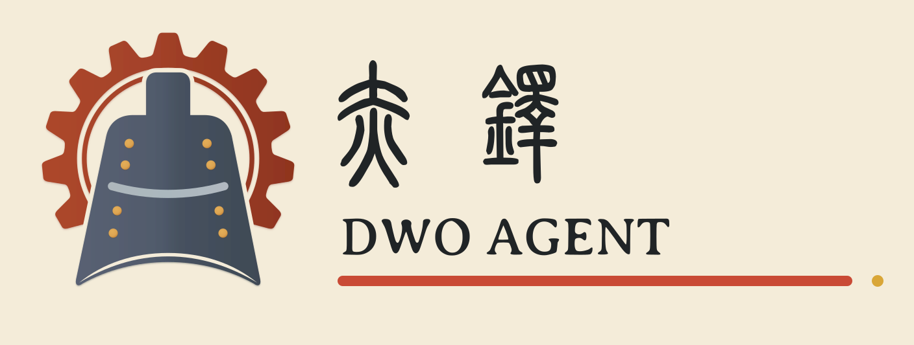

<p align="center">
  
</p>

<p align="center">
  <a href="https://www.rust-lang.org/"></a>
  <a href="https://github.com/Slipstream-Max"></a>
  <a href="https://github.com/Slipstream-Max/DwoAgent"></a>
</p>

<p align="center">
  <strong>一个 Agent Runtime，只做一件事：让你的 AI 常驻在身边。</strong><br>
  Rust 原生，常驻内存 ~6MB，CLI、IDE、微信、Telegram、飞书、QQ Bot 随时连接。
</p>

---

赤铎不是又一层 LLM 包装器，而是你设备上的常住助手。CLI、ACP、微信、Telegram、飞书、QQ Bot——随便哪个入口接入，对话都不会断。任务从 IDE 发起，手机上继续，无缝接力。

模型调用、终端、文件编辑、MCP、skills、subsessions、权限控制、上下文压缩和定时任务均已内置。core 可以单独嵌入其他程序，system prompt、agent step、存储和工具都可以按需定制。

## 🤔 为什么做了赤铎

赤铎是一个体积小、性能好、功能完整的 Agent 运行时。Core 保留日常使用需要的功能，稍加配置就能作为长期使用的个人 Agent。清楚的 Rust API 也方便继续开发和做实验。

OpenClaw 功能很全，但常驻内存、组件数量和整体复杂度也跟着上去了。CLI、Web UI、gateway 和 runtime 全塞在一个大项目里，想把 Agent core 单独拎出来，牵一发动全身。很多轻量 claw 项目只做了基本的 agent loop，session、MCP、skills、subsessions、权限、消息渠道、多端协作——这些还没补齐。另一头呢，成熟的 Agent 已经定型，想从头调 system prompt、agent step、工具和存储，也得脱层皮。🫠

赤铎就做一件事：Agent Runtime。CLI 管 daemon，ACP 和 channel 处理对话，`dwo-agent-service` 是可嵌入的 session core。按需拼装——单独用也行，组合起来就是一个完整的个人 Agent。✨

## ✨ 特点

| 亮点 | 说明 |
| --- | --- |
| **Rust 原生实现** | daemon 和 agent loop 运行在同一个原生二进制中，基础 daemon 实际常驻内存约 `6 MB`，也能处理多个并行 session。内存占用会随活跃 session、channel 和 MCP 连接变化。 |
| **完整 Agent 功能** | 内置终端、文件编辑、MCP、skills、subsessions、上下文压缩、权限控制和 cron automation。 |
| **Responses 原生支持** | OpenAI、DeepSeek 和兼容网关统一使用 Responses API；本地工具与 provider 托管的 Web Search 可以出现在同一轮里，并作为正常工具事件回放。 |
| **本地与远程入口** | 本地支持 ACP 和 CLI，远程支持微信、Telegram、飞书/Lark、QQ Bot，图片和文件也可以进入 session。 |
| **Session 原生广播** | ACP 和各个 channel 可以同时订阅同一个 session，已连接端点都能查看进度、取消任务、处理权限请求和继续发送消息。 |
| **运行中继续操作** | 新消息按顺序进入队列，在模型响应或工具调用的边界加入当前 turn。一个入口等待回复时，其他入口仍可正常操作。 |
| **持久化会话** | 当前模型上下文和完整 transcript 分开存储，压缩上下文不会删除原始记录。 |
| **三种权限模式** | `full_access` 适合可信环境，`confirm` 会请求确认，`watch` 只开放简单的只读操作。 |
| **可嵌入 Core** | `dwo-agent-service` 暴露 session、repository、model、event 和 config API，可用于桌面应用、IDE、服务端程序和实验项目。 |
| **文件化配置** | system prompt、`AGENTS.md`、skills、模型和 MCP 都有固定目录，修改后由 watcher 更新现有 session。 |

## 🧠 关于记忆

赤铎目前没有额外加入长期记忆系统，也没有内置向量库、用户画像或自动提取并写回记忆的流程。现阶段还没有找到在准确性、可控性、成本和维护复杂度上都适合日常使用的方案。

Session 会保存完整 transcript 和当前模型上下文，明确需要长期保留的内容可以放进 system prompt、`AGENTS.md` 或 skills。以后出现经过实际使用验证的记忆方案，再考虑加入对应能力。

## 🚀 五分钟跑起来

需要 Rust `1.95` 或更新版本。

```bash
git clone https://github.com/Slipstream-Max/dwoagent.git
cd dwoagent
cargo build --release -p dwo-agent
```

Windows PowerShell：

```powershell
.\target\release\dwo.exe install --start
.\target\release\dwo.exe daemon status
```

macOS / Linux：

```bash
./target/release/dwo install --start
~/.dwoagent/bin/dwo daemon status
```

`install` 会把可执行文件和默认 profile 安装到 `~/.dwoagent/`。Windows 会将 `~/.dwoagent/bin` 加入用户 PATH 并注册登录启动任务；macOS 使用 LaunchAgent。Linux 当前不会修改 PATH 或注册系统服务，可以把 `~/.dwoagent/bin` 加入 PATH，或用 `dwo serve` 前台运行。

默认模型需要 `DEEPSEEK_API_KEY`。在启动 daemon 的环境中设置它：

```powershell
$env:DEEPSEEK_API_KEY = "your-key"
dwo daemon start
```

```bash
export DEEPSEEK_API_KEY="your-key"
dwo daemon start
```

模型、权限和 channel 都在 `~/.dwoagent/profile.yaml` 配置，完整字段见 [Profile 配置指南](docs/profile.md)。

> Windows ARM64 构建需要进入 Visual Studio Developer PowerShell，并选择 ARM64 host/toolchain，使 `ring` 等原生依赖能够找到 C 编译器。

## 📂 Profile 目录结构

`dwo install` 在 `~/.dwoagent/` 下创建 `profile.yaml`、`resource/`（prompts、skills、MCP）、`runtime/`（session 数据和日志）和 `channels/`。日常只需要编辑 `profile.yaml` 和 `resource/`，其余由 daemon 自动管理。

完整目录树、YAML 字段和运行数据说明 → [Profile 配置指南](docs/profile.md)

## ⌨️ CLI 快速上手

启动和检查服务：

```text
dwo daemon start
dwo daemon status
dwo daemon stop
dwo serve                  # 前台运行 daemon，适合调试
```

从终端提交第一项任务：

```powershell
dwo session prompt "检查这个项目并说明它的结构" --cwd C:\path\to\project --title "project review"
dwo session list
dwo session watch <session-id>
```

CLI 的 `prompt` 用来提交任务，`watch` 用来读取最新事件。需要连续聊天时，可以直接接 ACP 或消息 channel。

完整命令参考 → [CLI 命令参考](docs/commands.md)

## 🧰 原生工具

赤铎内置四个由 Rust runtime 直接执行的基础工具，不需要额外配置 MCP server：

| 工具 | 用途 |
| --- | --- |
| **终端 `terminal`** | 启动命令、向交互式终端写入输入、轮询增量输出或终止进程。多个独立终端可以并行运行，所有操作都会经过当前 session 的权限策略。 |
| **读取 `read_file`** | 读取 UTF-8 文本或 PNG、JPEG、GIF、WebP 图片。文本每次最多返回 500 行，并通过 `cursor` 继续读取；图片只会加入支持图片输入的模型上下文。 |
| **写入 `file_edit`** | 使用结构化 patch 新建、修改、移动或删除文件。一次调用可以按顺序表达多个相关文件变更；`confirm` 模式需要确认，`watch` 模式禁止写入。 |
| **交接 `handoff`** | Agent 判断上下文需要重建时调用：附上交接摘要，daemon 用它压缩当前上下文，同一 turn 在新上下文中继续。始终允许，不经过权限确认。 |

`read_file` 和 `file_edit` 使用 session 的工作目录解析相对路径。没有显式指定 `cwd` 的 session 使用自己的隔离工作区。

长会话的上下文压缩、`/compact` 命令和 `handoff` 的完整行为见 [上下文压缩与 Handoff](docs/context.md)。

## 💬 怎么和它说话

### ACP：从 IDE 或 ACP 客户端连接

先确保 daemon 正在运行，然后把下面的进程配置为客户端的 ACP agent：

```text
command: dwo
args: [acp, --protocol, v2]
```

`dwo acp` 默认使用 ACP v2；旧客户端可以显式传入 `--protocol v1`。它只负责在 ACP 和本地 IPC 之间转接，真正的 session、模型和工具仍由 daemon 掌管，所以从 IDE 切到手机或 CLI 时，对话还在原处。具体能力、客户端配置要点与限制见 [ACP 使用指南](docs/acp.md)。

### Channels：从聊天应用连接

赤铎目前支持微信、Telegram、飞书/Lark、QQ Bot 私聊和 ACP WebSocket。启用 channel 后重启 daemon；消息 channel 再完成绑定：

```text
dwo channel weixin bind       # 终端扫码
dwo channel telegram bind     # 私聊机器人发送一次性 /bind <code>
dwo channel feishu bind       # 私聊机器人发送一次性 /bind <code>
dwo channel qq bind           # QQ 官方二维码
```

Telegram 使用 long polling，飞书/Lark 使用 WebSocket 长连接，都不需要公网 webhook。环境变量、开放平台权限和完整部署步骤见 [Channel 部署与使用](docs/channels.md)。

普通文本直接作为 prompt 发送；在 `confirm` 模式下回复 `/allow` 或 `/deny` 即可处理权限请求。

常用 slash commands：

| 命令 | 用途 |
| --- | --- |
| `/skill <名称> [提示]` | 要求 Agent 使用指定 skill |
| `/mcp <名称> [提示]` | 要求 Agent 使用指定 MCP server |
| `/plan [上下文]` | 暂停并先一起规划，达成共识前不写代码 |
| `/compact` | 手动压缩当前 session 上下文 |
| `/resume` | session 空闲时继续上一项工作 |
| `/fork` | 把当前 session 复制为新 session |
| `/status` | 查看当前 session 状态 |
| `/new [名称] [--cwd <路径>]` | 创建并选择 session（channel） |
| `/use <session>` | 切换到已有 session（channel） |
| `/model <名称>` | 切换当前 session 的模型（channel） |
| `/allow` `/deny` | 处理权限请求（channel，confirm 模式） |

完整命令列表、示例和入口对照 → [Slash Commands 使用指南](docs/slash-commands.md)

## 🧩 一个不够？派小弟

当前 agent 可以创建子 session，把检查模块、查找资料、运行测试等独立工作分出去。每个子 session 都有自己的上下文和 transcript，默认继承父 session 的工作目录、权限、模型和 reasoning；子 session 的权限不能高于父 session。

子任务完成后，daemon 自动把结果送回父 session。父 session 忙时会在当前 turn 结束后接手处理，不需要轮询。子 session 还能继续派自己的小弟，结果沿树逐层返回。完整用法和示例 → [Subsessions 使用指南](docs/subsessions.md)

## ⏰ 让它替你值班

在 `profile.yaml` 里写一段 cron，daemon 到点自动创建 session 跑任务。支持每次新建 session 或持续投递同一个 session。无人值守时工具权限请求会自动拒绝，不会卡住。完整配置和示例 → [Automation 使用指南](docs/automation.md)

## 🔀 运行全景

```text
                         +------------------+
 ACP client ------------>|                  |
 CLI ------------------->|    dwo daemon    |----> model provider
 Weixin ---------------->|                  |----> terminal / file tools
 Telegram -------------->| sessions + MCP   |----> managed MCP servers
 Feishu/Lark ----------->| + automation     |
 QQ Bot ---------------->|                  |
                         +------------------+
```

所有入口共享 session，每个 channel 会单独保存当前选择的 session。没有显式 `cwd` 的 session 使用 `runtime/workspaces/<session-id>/`；完整 transcript 与当前模型上下文分别持久化，模型压缩不会删除 transcript。

## 🔌 Core 嵌入

真正运行 session 和 agent loop 的代码在 `crates/dwo-agent-service`。它提供这些公开类型：

- `AgentService`：创建、加载、列出和删除 session。
- `SessionAgent`：提交 prompt、订阅事件、取消 turn、修改配置和处理权限请求。
- `SessionRepository`：session 存储接口，项目内已经有内存和文件系统实现。
- `ModelClient`：模型接口，可以使用 profile 创建默认 client，也可以接入自定义实现。
- `SessionSubscription`：先返回完整 snapshot，再持续接收广播事件。

`dwo-agent` crate 在 core 外面加上 daemon、IPC、CLI、ACP、channels、MCP 和 automation。只需要 Agent 能力时，可以直接依赖 core；需要完整个人 Agent 时，运行 `dwo` daemon 即可。

System prompt 位于 `resource/prompts/System.md`，项目规则位于 `resource/prompts/AGENTS.md`，skills 和 MCP 也使用独立目录。做新的 agent step、上下文策略、工具策略或客户端时，可以从对应 crate 开始修改，不需要先拆开一个完整的 Web 产品。

## 📝 写在最后

赤铎来自实际使用中的需求，目前也用于作者的日常 Agent 工作流。后续开发会继续做好稳定常驻、多端协作、低开销和扩展能力。

## 📚 文档索引

| 文档 | 内容 |
| --- | --- |
| [文档索引](docs/README.md) | 按首次使用、日常操作和深入理解组织的阅读入口 |
| [ACP 使用指南](docs/acp.md) | ACP 启动、session、权限、内容类型与限制 |
| [Channel 部署与使用](docs/channels.md) | 微信、Telegram、飞书/Lark、QQ Bot 部署和 slash commands |
| [Slash Commands 使用指南](docs/slash-commands.md) | 所有 `/` 命令的用途、示例与入口对照 |
| [Subsessions 使用指南](docs/subsessions.md) | 父子 session、配置继承、结果回传和常用命令 |
| [Automation 使用指南](docs/automation.md) | Cron、时区、新建/固定 session 和无人值守行为 |
| [CLI 命令参考](docs/commands.md) | daemon、session、MCP、channel、automation 命令 |
| [Profile 配置指南](docs/profile.md) | 完整 profile.yaml、资源目录、模型、MCP 与运行数据 |

## 🛠️ 开发

```powershell
cargo fmt --all
cargo test --workspace
```

工作区按功能拆成几个 crate：`dwo-agent` 包含 daemon、CLI 和 adapters，`dwo-agent-service` 包含 session actor 和 agent loop，`dwo-context`、`dwo-model-client`、`dwo-mcp`、`dwo-tools` 与 `dwo-pty` 分别处理上下文、模型、MCP、工具和终端。
